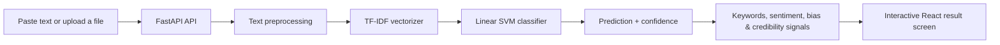

# TruthScan AI

<p align="center">
  <strong>Turn news text into a clear, data-informed credibility assessment.</strong>
</p>

<p align="center">
  <a href="https://truthscan-ai-froentand.onrender.com"><strong>Explore the live app</strong></a>
  &nbsp;•&nbsp;
  <a href="https://truthscan-ai-backend.onrender.com/docs">API documentation</a>
  &nbsp;•&nbsp;
  <a href="#getting-started">Run locally</a>
</p>

<p align="center">
  
  
  
  
</p>

> **Live URL:** [https://truthscan-ai-froentand.onrender.com](https://truthscan-ai-froentand.onrender.com)

TruthScan AI is a full-stack fake-news analysis platform. Paste an article or upload a document and receive a machine-learning prediction, confidence score, explanatory keywords, language signals, and optional account-based history. It is designed to support critical reading—not to replace professional fact-checking.

## Highlights

| Capability | What it does |
| --- | --- |
| News analysis | Classifies supplied text as **Real** or **Fake** with a confidence score. |
| Explainable results | Surfaces influential keywords, suspicious language, sentiment, bias, summary, and credibility signals. |
| File upload | Reads `.txt`, `.pdf`, and `.docx` documents (up to 10 MB) before analysis. |
| Guest-friendly | Visitors can analyze content without creating an account. |
| Accounts and history | JWT authentication, saved prediction history, profile management, and password-reset flow. |
| Dashboard and reports | Personal activity overview plus exportable report functionality for signed-in users. |
| Admin tools | User management and aggregate platform analytics for administrators. |

## How it works



The model evaluates patterns in the provided text. A prediction is an automated signal and can be wrong; check original reporting, evidence, dates, and trusted fact-checking sources before sharing content or making decisions.

## Technology

**Frontend**

- React 19, TypeScript, Vite, React Router
- Tailwind CSS and shadcn/ui components
- Axios, React Context, Framer Motion, Recharts, Sonner, Lucide

**Backend**

- FastAPI, Pydantic Settings, SQLAlchemy (async), Alembic
- SQLite for local development; PostgreSQL-compatible configuration for production
- JWT authentication, bcrypt password hashing, rate limiting, CORS middleware
- scikit-learn Linear SVM and TF-IDF vectorization
- `pypdf` and `python-docx` for document text extraction

## Project structure

```text
TruthScan-AI/
├── frontend/                 # React single-page application
│   ├── src/pages/            # Analyze, dashboard, history, auth, admin pages
│   ├── src/components/       # Shared and UI components
│   ├── src/services/         # API client and feature services
│   └── src/context/          # Authentication, prediction, and theme state
├── backend/                  # FastAPI application
│   ├── app/api/              # HTTP endpoints
│   ├── app/ai/               # Analysis helpers and report generation
│   ├── app/ml/               # Predictor, preprocessing, and trained artifacts
│   ├── app/database/         # Models, sessions, and CRUD operations
│   ├── app/services/         # Business logic
│   └── tests/                # API and prediction tests
└── docker-compose.yml        # Local container orchestration
```

## Getting started

### Prerequisites

- Python 3.11 or newer
- Node.js 18 or newer
- npm

### 1. Clone the project

```bash
git clone https://github.com/samarthupadhyay2294-rgb/TruthScan-AI.git
cd TruthScan-AI
```

### 2. Start the backend

```bash
cd backend
python -m venv .venv
```

Activate the environment:

```bash
# macOS / Linux
source .venv/bin/activate

# Windows PowerShell
.venv\Scripts\Activate.ps1
```

Install dependencies and configure the application:

```bash
pip install -r requirements.txt
copy .env.example .env          # Windows
# cp .env.example .env          # macOS / Linux
uvicorn main:app --reload
```

The API will be available at `http://127.0.0.1:8000`, with interactive documentation at `http://127.0.0.1:8000/docs`.

### 3. Start the frontend

In a second terminal:

```bash
cd frontend
copy .env.example .env          # Windows
# cp .env.example .env          # macOS / Linux
npm install
npm run dev
```

Open the local URL printed by Vite (normally `http://localhost:5173`).

## Configuration

### Frontend environment variables

```env
VITE_API_BASE_URL=http://127.0.0.1:8000/api
VITE_APP_NAME=TruthScan AI
VITE_APP_VERSION=1.0.0
```

### Backend environment variables

```env
DATABASE_URL=sqlite+aiosqlite:///./truthlens.db
JWT_SECRET=replace-with-a-long-random-secret
FRONTEND_URL=http://localhost:5173
CORS_ORIGINS=http://localhost:5173
SMTP_HOST=smtp.gmail.com
SMTP_PORT=587
SMTP_USER=your-email@example.com
SMTP_PASSWORD=your-app-password
```

Never commit secrets or production credentials. Use your hosting provider’s environment-variable dashboard instead.

## API reference

All application routes are prefixed with `/api`.

| Area | Endpoint | Description |
| --- | --- | --- |
| Authentication | `POST /api/auth/signup` | Create an account. |
| Authentication | `POST /api/auth/login` | Sign in and receive a JWT. |
| Prediction | `POST /api/predict` | Analyze supplied news text. |
| Upload | `POST /api/upload` | Extract and analyze a TXT, PDF, or DOCX file. |
| Dashboard | `GET /api/dashboard` | Fetch dashboard statistics. |
| History | `GET /api/history` | Fetch saved predictions. |
| Reports | `GET /api/reports` | List user reports. |
| Profile | `GET /api/profile` | Retrieve the signed-in user’s profile. |
| Admin | `GET /api/admin/analytics` | Retrieve platform analytics for admins. |

Example request:

```bash
curl -X POST http://127.0.0.1:8000/api/predict \
  -H "Content-Type: application/json" \
  -d '{"text":"Researchers have published a study on urban air quality."}'
```

For full request and response schemas, use the [live Swagger UI](https://truthscan-ai-backend.onrender.com/docs).

## Deployment on Render

This project can be deployed manually as two services:

1. **Backend:** create a Render Web Service from the repository.
   - Build command: `cd backend && pip install -r requirements.txt`
   - Start command: `cd backend && uvicorn main:app --host 0.0.0.0 --port $PORT`
2. **Frontend:** create a Render Static Site.
   - Build command: `cd frontend && npm ci && npm run build`
   - Publish directory: `frontend/dist`
3. In the frontend service’s environment variables, set:

   ```env
   VITE_API_BASE_URL=https://truthscan-ai-backend.onrender.com/api
   ```

4. In the backend service’s environment variables, set `FRONTEND_URL` and `CORS_ORIGINS` to:

   ```text
   https://truthscan-ai-froentand.onrender.com
   ```

The `/api` suffix is required. Without it, requests to the analyzer route will return `404`.

## Testing and quality checks

```bash
# Backend tests
cd backend
pytest

# Frontend checks
cd frontend
npm run lint
npm run build
```

## Contributing

Contributions are welcome. Please open an issue to discuss a significant change, then submit a focused pull request with a clear description and relevant tests.

## License

This project is available under the MIT License. Add a `LICENSE` file to the repository if one has not already been included.

---

Built by [Samarth Upadhyay](https://github.com/samarthupadhyay2294-rgb) · [Open TruthScan AI](https://truthscan-ai-froentand.onrender.com)
